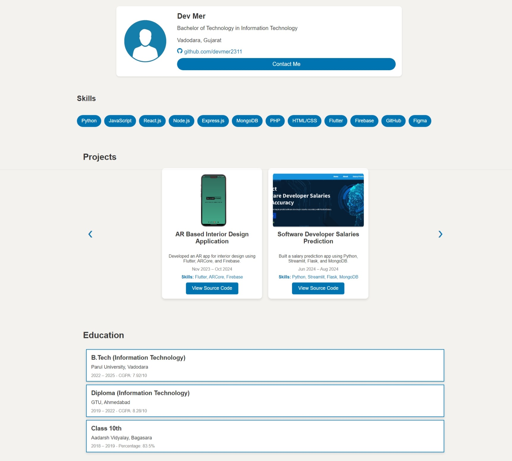
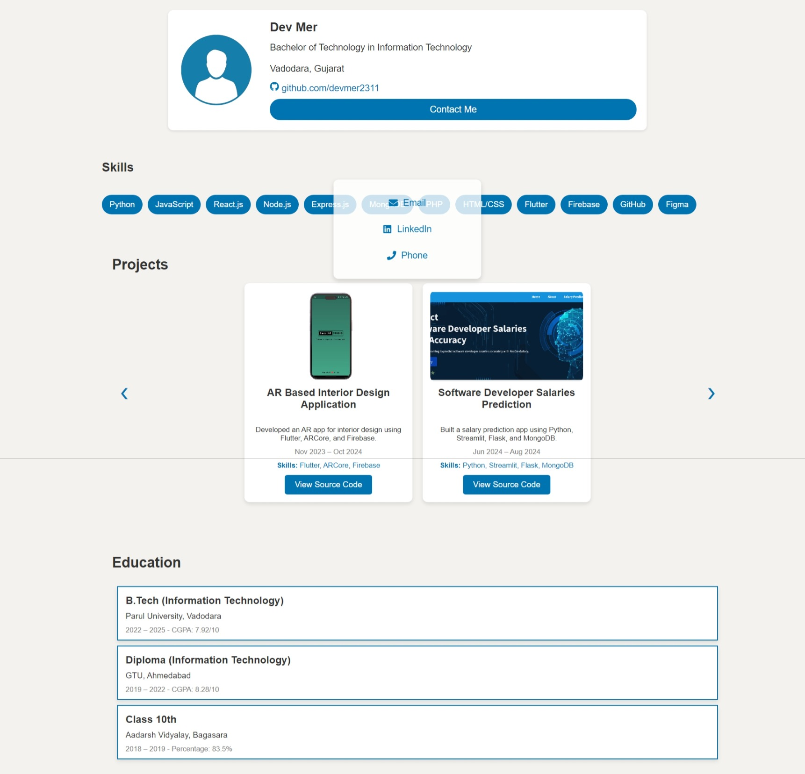

# **Portfolio Project**

## 1. Task Description

The task is to create a **Portfolio Website** that showcases a user's skills, projects, and education in a clean and modern layout. The website includes sections for the **hero section**, **projects**, **skills**, and **education**. It is designed to be **responsive**, ensuring it looks good on both desktop and mobile devices. The site allows users to navigate through different sections smoothly, offering details about the user’s qualifications and experiences.

The **Projects** section includes a slider to showcase projects with images, details, and links to source code, while the **Education** section is designed using rectangular cards to display academic qualifications. The **Skills** section displays a list of technical skills in a horizontally-aligned, easy-to-read format. 

The portfolio is built using **React**, with state management provided by React's `useState` hook. The design employs modern **CSS techniques** such as **Flexbox**, **Grid**, and **Hover Effects** to ensure a polished and interactive user experience.

---

## 2. Task Output Screenshot

---

## 3. Widget/Algorithm Used In Task

- **React Components**:  
  The portfolio consists of multiple React components, such as `Header`, `Projects`, `Education`, `Skills`, and `Footer`. Each section is modular and reusable, enhancing the maintainability and scalability of the website.

- **Image Gallery (Project Section)**:  
  The Projects section features a dynamic image gallery where users can view project details. The gallery uses a **slider** to show three projects at a time, with navigation buttons for moving between different sets of projects.

- **Responsive Layout**:  
  The design is fully responsive, using **CSS Flexbox** and **Grid** to organize the layout of the page elements. The layout adapts for different screen sizes, ensuring an optimal viewing experience on mobile, tablet, and desktop devices.

- **Hover Effects**:  
  Hover effects are applied to project cards and buttons. This enhances the user experience by providing visual feedback when interacting with elements on the page.

- **State Management (React `useState`)**:  
  The React `useState` hook is used to manage dynamic content, such as handling the display of the **Projects slider** and user interactions.

- **CSS Animations**:  
  Smooth animations, such as the hover effect on project cards, are implemented using **CSS transitions**. These animations provide a polished user experience.

- **JSON Data for Projects**:  
  The project data (name, description, skills, image, etc.) is stored in a JSON array. This data is dynamically rendered in the `Projects` section using React's rendering logic.

- **Font and Icon Libraries**:  
  The website uses font libraries such as **Google Fonts** for consistent typography and **React Icons** for displaying social media and technology icons.

---
